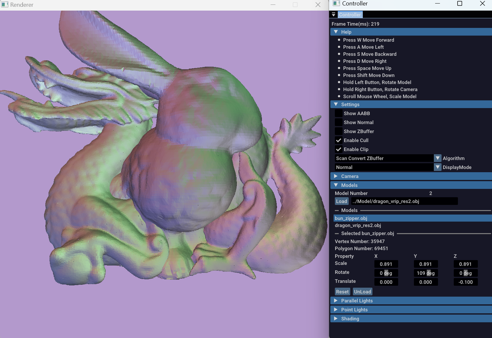
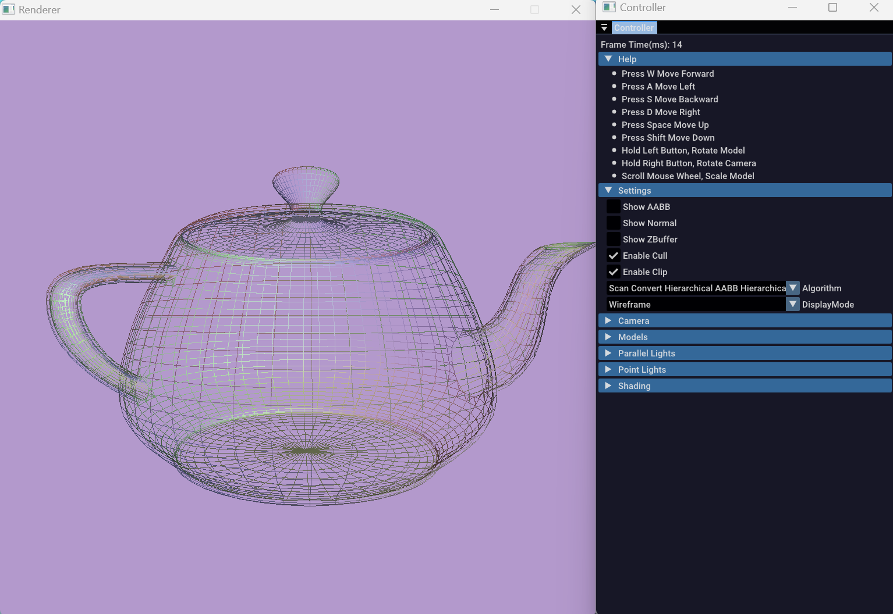
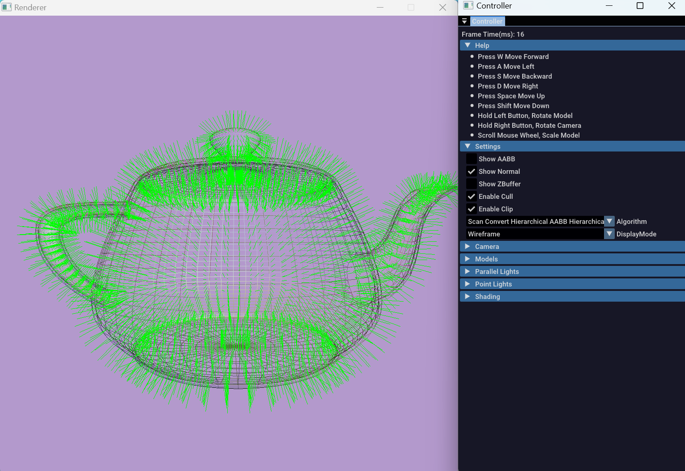
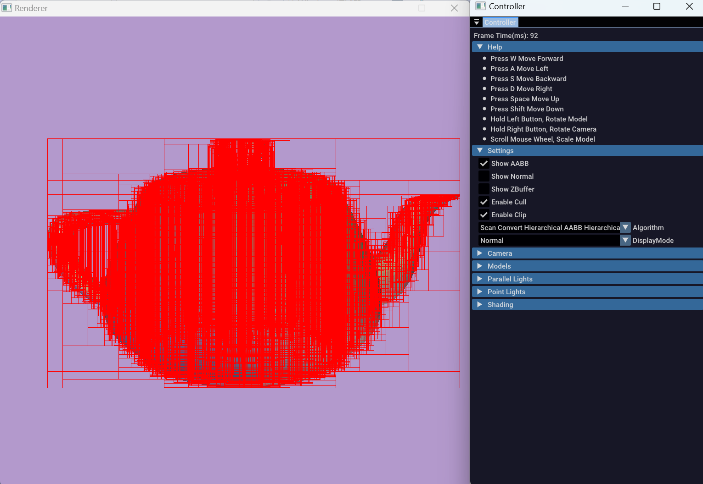
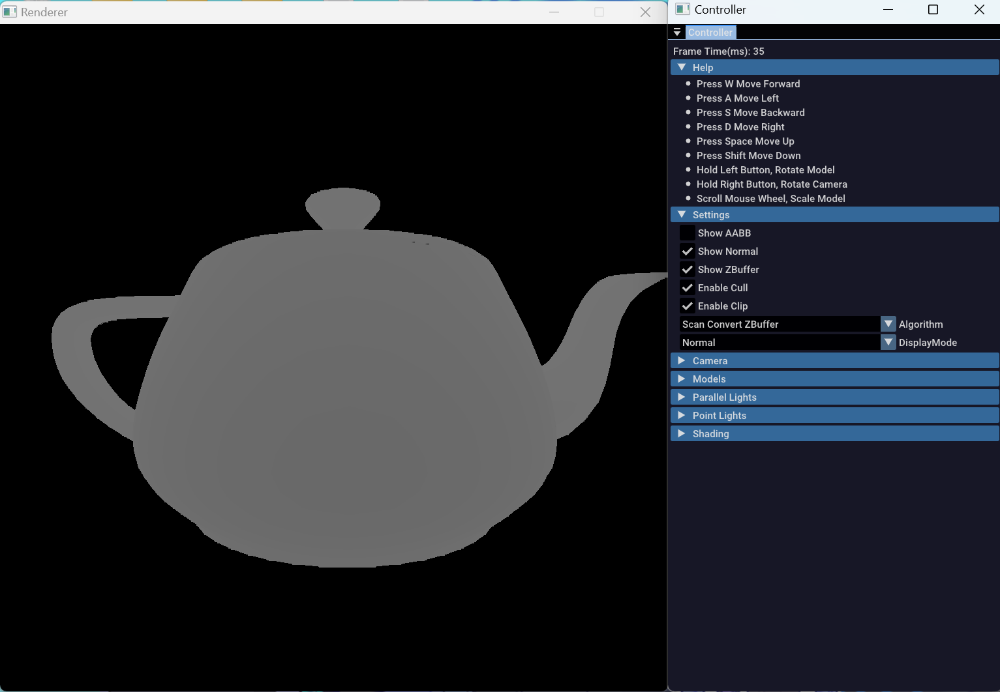

# 2024秋计算机图形学上机作业

[](https://github.com/AliceRemake/SoftwareRenderer/actions/workflows/cmake-single-platform.yml)[](https://github.com/AliceRemake/SoftwareRenderer/blob/main/LICENSE)



## 工具链和平台

| 工具链                                                                                     | 平台                                                         |
|-----------------------------------------------------------------------------------------|------------------------------------------------------------|
| [](https://www.mingw-w64.org/) |  |

## 编译

#### git-bash

```bash
mkdir build && cd build
cmake -G "MinGW Makefiles" -DCMAKE_BUILD_TYPE=Release ..
mingw32-make -j16
```

#### powershell

```shell
mkdir build && cd build
cmake.exe -G "MinGW Makefiles" -DCMAKE_BUILD_TYPE=Release ..
mingw32-make.exe -j16
```

## 功能

* 显示包围盒，面法线和ZBuffer
* 背面剔除
* 视域四棱锥裁剪
* 消隐算法
  * 简单的ZBuffer算法
  * 简单的层次ZBuffer算法
  * 层次ZBuffer算法 + 层次包围盒
* 基本的建模功能
  * 可以导入模型，调整模型，可以支持多边形网格
  * 可以导入光源（平行光、点光源），调整光源
  * 可以调整、移动相机
  * 可以调整光照模型










## 性能对比

| 模型                              | 顶点数    | 面数      |
|---------------------------------|--------|---------|
| cube.obj                        | 8      | 12      |
| teapot.obj                      | 7850   | 8028    |
| geodesic_dual_classIII_20_7.obj | 11780  | 5892    |
| bun_zipper.obj                  | 35947  | 69451   |
| Armadillo.obj                   | 172974 | 345944  |
| dragon_vrip.obj                 | 437645 | 871414  |
| happy_vrip.obj                  | 543652 | 1087716 |

使用内存不连续的Z Pyramid和递归算法 [baseline](https://github.com/AliceRemake/SoftwareRenderer/tree/baseline)

| 模型                              | Z Buffer | Z Buffer + Z Pyramid | Z Buffer + Z Pyramid + AABB | Interval Scandline |
|---------------------------------|----------|----------------------|-----------------------------|----------------------|
| cube.obj                        |15        |55                    |60                           |11                    | 
| teapot.obj                      |21        |55                    |97                           |27                  |
| geodesic_dual_classIII_20_7.obj |19        |56|78|19|
| bun_zipper.obj                  |62|131|298|106|                
| Armadillo.obj                   |265|441|1281|385|                
| dragon_vrip.obj                 |613|879|3050|866|             
| happy_vrip.obj                  |762|1045|4815|1070|             

使用内存连续的Z Pyramid和非递归算法

| 模型                              | Z Buffer | Z Buffer + Z Pyramid | Z Buffer + Z Pyramid + AABB | Interval Scandline | 
|---------------------------------|----------|----------------------|-----------------------------|--------------------|
| cube.obj                        | 10       | 24                   | 24                          | 11                 |                        
| teapot.obj                      | 21       | 27                   | 55                          | 27                 |                      
| geodesic_dual_classIII_20_7.obj | 19       | 24                   | 39                          | 19                 | 
| bun_zipper.obj                  | 62       | 82                   | 210                         | 106                |                  
| Armadillo.obj                   | 265      | 332                  | 1024                        | 400                |                   
| dragon_vrip.obj                 | 619      | 762                  | 2540                        | 878                |                 
| happy_vrip.obj                  | 765      | 911                  | 3807                        | 1053               |                  

是否开启背面裁剪

| 模型                              | Z Buffer + cull | Z Buffer |
|---------------------------------|----------|----------------------|
| cube.obj                        | 10       | 11                   |                    
| teapot.obj                      | 21       | 29                   |                     
| geodesic_dual_classIII_20_7.obj | 19       | 30                   |
| bun_zipper.obj                  | 62       | 115                   |                
| Armadillo.obj                   | 265      | 497                  |               
| dragon_vrip.obj                 | 619      | 1140                  |               
| happy_vrip.obj                  | 765      | 1345                  |  

存在大量物体被遮挡的场景下（10 个 dragon_vrip.obj 被 cube.obj 遮挡）(区间扫面线算法目前只考虑了单个模型的消隐，所以这里不进行测试)

| Z Buffer | Z Buffer + Z Pyramid | Z Buffer + Z Pyramid + AABB | 
|----------|----------------------|-----------------------------|
| 5880     | 6275                 | 5542                        |

## 性能分析

从结果来看，简单的Z Buffer算法效果最好，使用包围盒的层次Z Buffer反而表现不好。原因可能是层次包围盒的构造和查询占用了大量的时间。因为这里的包围盒不用加速与世界坐标下的射线求交，因此我在每一帧的屏幕坐标系下直接构造层次包围盒树。我实现的层次包围盒树使用了简单的按质心x坐标分割的二叉树，这样导致了大量的冗余节点。每次绘制模型时，需要从根节点开始，依次查询Z Pyramid，每次查询Z Pyramid都要花费一定的时间。由于大量的不可见面片已经被背面剔除去除，因此造成了许多冗余查询操作。从实验来看，背面剔除是最简单高效的加速算法。经过背面剔除后，对单个模型而言，剩下的面片倾向于整体可见或者整体不可见，因此一种更好的方式是对每个模型构造一个包围盒，然后在整个场景构造层次包围盒树。每次只用包围盒判断整个模型是否可见，然后直接用简单的Z Buffer算法绘制。
