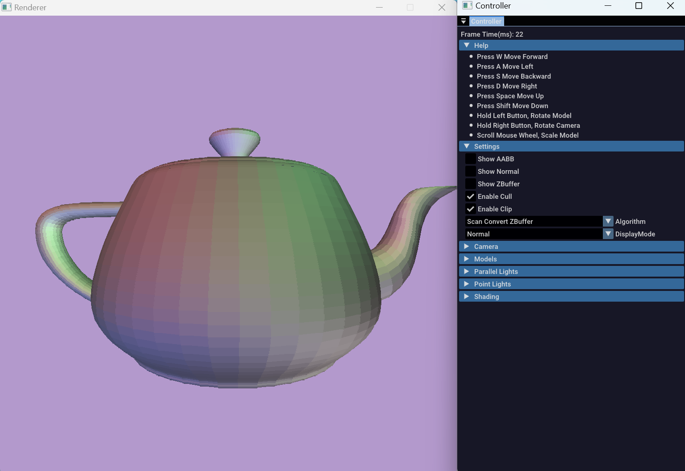

# 2024秋计算机图形学上机作业

[](https://github.com/AliceRemake/SoftwareRenderer/actions/workflows/cmake-single-platform.yml)[](https://github.com/AliceRemake/SoftwareRenderer/blob/main/LICENSE)


## 工具链和平台

| 工具链                                                                                     | 平台                                                         |
|-----------------------------------------------------------------------------------------|------------------------------------------------------------|
| [](https://www.mingw-w64.org/) |  |

## 编译

#### git-bash

```bash
mkdir build && cd build
cmake -G "MinGW Makefiles" -DCMAKE_BUILD_TYPE=Release ..
mingw32-make -j16
```

#### powershell

```shell
mkdir build && cd build
cmake.exe -G "MinGW Makefiles" -DCMAKE_BUILD_TYPE=Release ..
mingw32-make.exe -j16
```

## 功能

* 显示包围盒，面法线和ZBuffer
* 背面剔除
* 视域四棱锥裁剪
* 消隐算法
  * 简单的ZBuffer算法
  * 简单的层次ZBuffer算法
  * 层次ZBuffer算法 + 层次包围盒
* 基本的建模功能
  * 可以导入模型，调整模型，可以支持多边形网格
  * 可以导入光源（平行光、点光源），调整光源
  * 可以调整、移动相机
  * 可以调整光照模型




## 性能对比

| 模型                              | 顶点数    | 面数      |
|---------------------------------|--------|---------|
| cube.obj                        | 8      | 12      |
| teapot.obj                      | 7850   | 8028    |
| geodesic_dual_classIII_20_7.obj | 11780  | 5892    |
| bun_zipper.obj                  | 35947  | 69451   |
| Armadillo.obj                   | 172974 | 345944  |
| dragon_vrip.obj                 | 437645 | 871414  |
| happy_vrip.obj                  | 543652 | 1087716 |

使用内存不连续的Z Pyramid和递归算法

| 模型                              | Z Buffer | Z Buffer + Z Pyramid | Z Buffer + Z Pyramid + AABB |  
|---------------------------------|----------|----------------------|-----------------------------|
| cube.obj                        |          |                      |                             |                        
| teapot.obj                      |          |                      |                             |                      
| geodesic_dual_classIII_20_7.obj |          |                      |                             | 
| bun_zipper.obj                  |          |                      |                             |                  
| Armadillo.obj                   |          |                      |                             |                   
| dragon_vrip.obj                 |          |                      |                             |                 
| happy_vrip.obj                  |          |                      |                             |                  

使用内存连续的Z Pyramid和非递归算法

| 模型                              | Z Buffer | Z Buffer + Z Pyramid | Z Buffer + Z Pyramid + AABB | Interval Scandline | 
|---------------------------------|----------|----------------------|-----------------------------|--------------------|
| cube.obj                        | 10       | 24                   | 24                          | 11                 |                        
| teapot.obj                      | 21       | 27                   | 55                          | 27                 |                      
| geodesic_dual_classIII_20_7.obj | 19       | 24                   | 39                          | 19                 | 
| bun_zipper.obj                  | 62       | 82                   | 210                         | 106                |                  
| Armadillo.obj                   | 265      | 332                  | 1024                        | 400                |                   
| dragon_vrip.obj                 | 619      | 762                  | 2540                        | 878                |                 
| happy_vrip.obj                  | 765      | 911                  | 3807                        | 1053               |                  

存在大量物体被遮挡的场景下（10 个 dragon_vrip.obj 被 cube.obj 遮挡）(区间扫面线算法目前只考虑了单个模型的消隐，所以这里不进行测试)

| Z Buffer | Z Buffer + Z Pyramid | Z Buffer + Z Pyramid + AABB | 
|----------|----------------------|-----------------------------|
| 5880     | 6275                 | 5542                        |

## 性能分析


